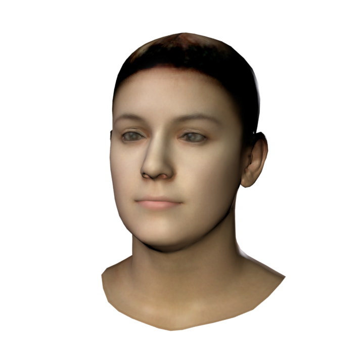
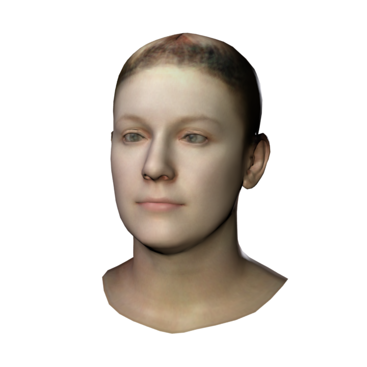
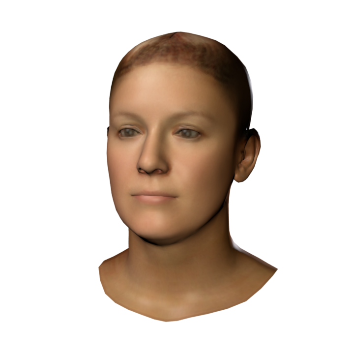
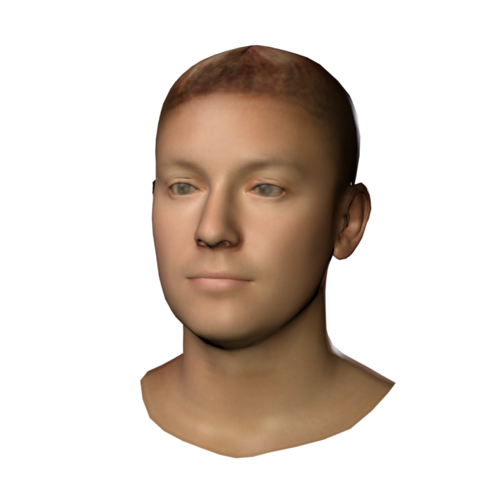
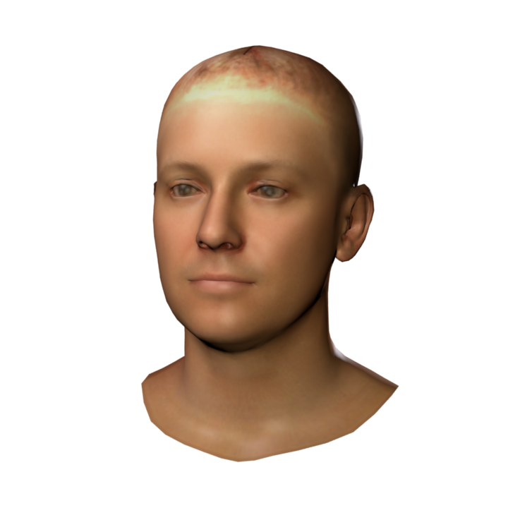
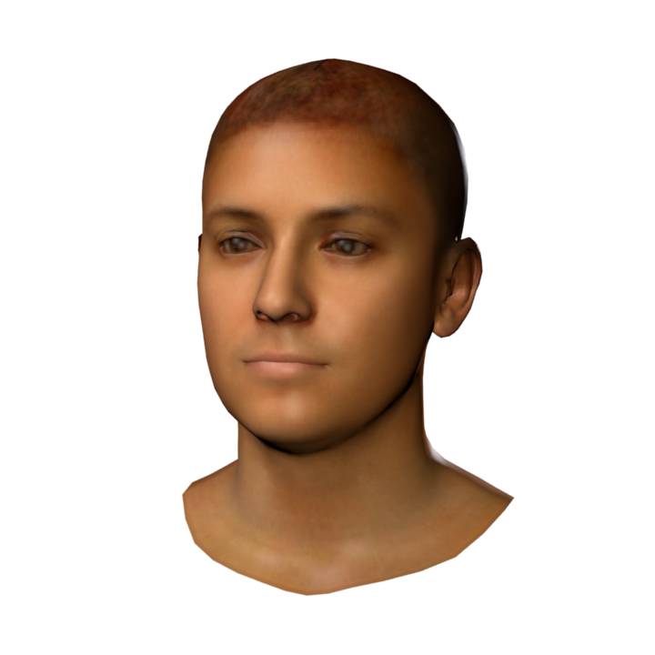
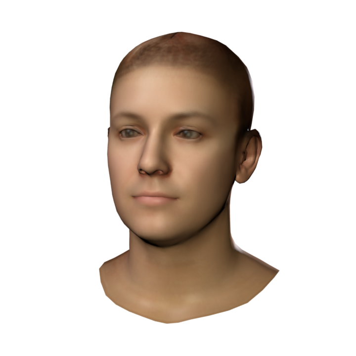
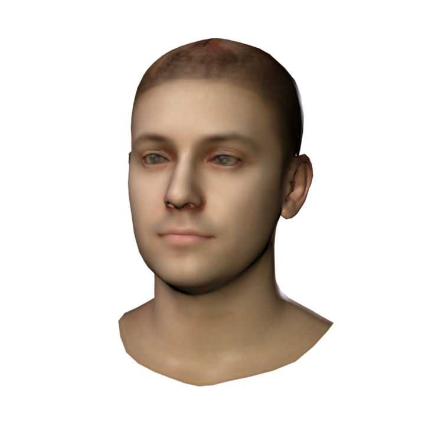
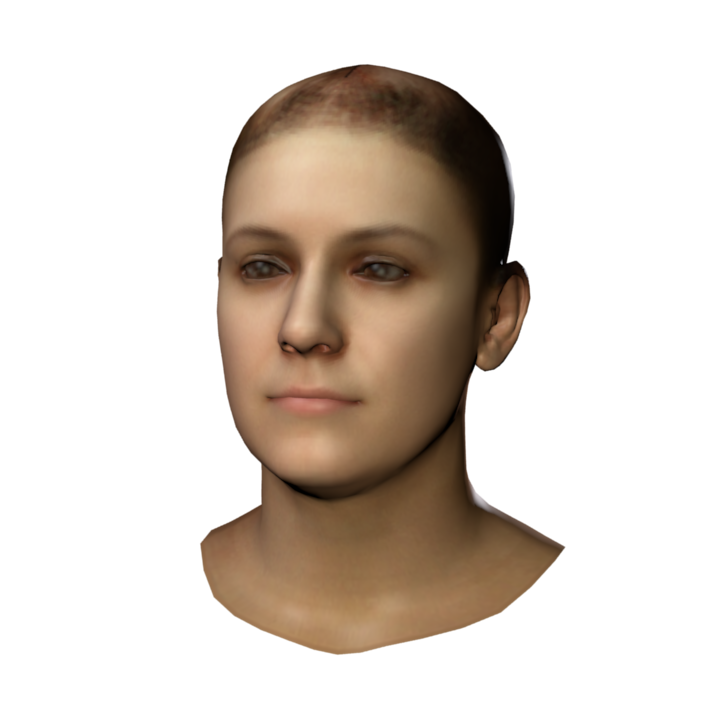

# Photometric FLAME Fitting

This repository provides an analysis-by-synthesis framework to fit a textured [FLAME](http://flame.is.tue.mpg.de/) model to an image. FLAME is a lightweight generic 3D head model learned from over 33,000 head scans, but it does not come with an appearance space (see the [scientific publication](https://ps.is.tuebingen.mpg.de/uploads_file/attachment/attachment/400/paper.pdf) for details). 

 

  
  

 

  
  

<em>Variations of the texture space for the first five principal components. Each column shows the variation for &plusmn;2 standard deviations along one axis.</em>

 
This repository 
1) describes how to build a texture space for FLAME from in-the-wild images, and provides
2) code to fit a textured FLAME model to in-the-wild images, optimizing for FLAME's parameters, appearance, and lighting, and
3) code to optimize for the FLAME texture to match an in-the-wild image. 

**The FLAME model and the texture space can be downloaded from the [FLAME project website](https://flame.is.tue.mpg.de). You need to sign up and agree to the license for access.**

**The demos will be released soon.**

## Build FLAME texture space from in-the-wild images

The goal is to build a texture space from in-the-wild images in order to cover large range of ethnicities, age groups, etc. We therefore randomly select 1500 images from the [FFHQ dataset](https://github.com/NVlabs/ffhq-dataset) in order to build a texture space. This is done in following steps

***1. Initialization***

Building a texture space from in-the-wild images is a chicken-and-egg problem. Given a texture space, it can be used in an analysis-by-synthesis fashion to fit the 3D model to images, where these fits then can be used to build a texture space. To get an initial texture space, we fit FLAME to the [Basel Face Model (BFM)](https://faces.dmi.unibas.ch/bfm/index.php?nav=1-0&id=basel_face_model) template, and project the BFM vertex colors onto the FLAME mesh, to get an initial texture basis.

***2. Model fitting***

We then fit FLAME to the FFHQ images, optimizing for the FLAME shape, pose, and expression parameters, the parameters of the initial texture space, the parameters for Spherical Harmonics (SH) lighting (we optimize for 9 SH coefficient only, shared across all three color channels), and a texture offset to capture texture details deviating from the initial texture space. The fitting minimizes a landmark loss, a photometric loss, and diverse regularizers for shape, pose, expression, appearance, and the texture offset. 

The landmark loss minimizes the difference between the landmarks projected from the face model's surface, and predicted 2D landmarks (predicted using the [FAN landmark predictor](https://github.com/1adrianb/face-alignment)). The photometric loss is optimized for the skin region only (provided by the [face segmentation network](https://github.com/YuvalNirkin/face_segmentation)) to gain robustness to partial occlusions. See the provided code for details how to fit a textured FLAME model to an image. 

***3. Texture completion***

After fitting, the computed texture offsets capture for each image the facial appearance of the non-occluded skin region. To complete the texture maps, we train an inpainting network adapted from [GMCNN](https://github.com/shepnerd/inpainting_gmcnn) (across all texture maps) supervisely by adding random strokes (i.e. strokes of random size and location) in the visible face region(visibility obtained from the fitted reconstruction) and learning to inpaint these strokes. Once trained, we inpaint all missing regions with the resulting inpainting network.

***4. Texture space computation***

After completing these 1500 texture maps, we use principal component analysis (PCA) to compute a texture space. 

## Demos

A simple demo to sample the texture space can be found [here](https://github.com/TimoBolkart/TF_FLAME).

***More advanced demos are coming soon***

## License
The code is available for non-commercial scientific research purposes. The texture model is available under [Creative Commons BY-NC-SA 4.0 license](https://creativecommons.org/licenses/by-nc-sa/4.0/). For details see the [Texture license](https://flame.is.tue.mpg.de/texturelicense).

## Notes
We use the FLAME.py from [FLAME_PyTorch](https://github.com/soubhiksanyal/FLAME_PyTorch)

## Citation

When using this code or the texture model in a scientific publication, please cite **this GitHub repository** and the **FFHQ dataset**. When using the FLAME geometry model, please cite the model (you find the up-to-date bibtex [here](https://flame.is.tue.mpg.de/)).

## Contact
For questions regarding the provided fitting code please contact haiwen.feng@tuebingen.mpg.de, for FLAME related questions please contact flame@tuebingen.mpg.de.
